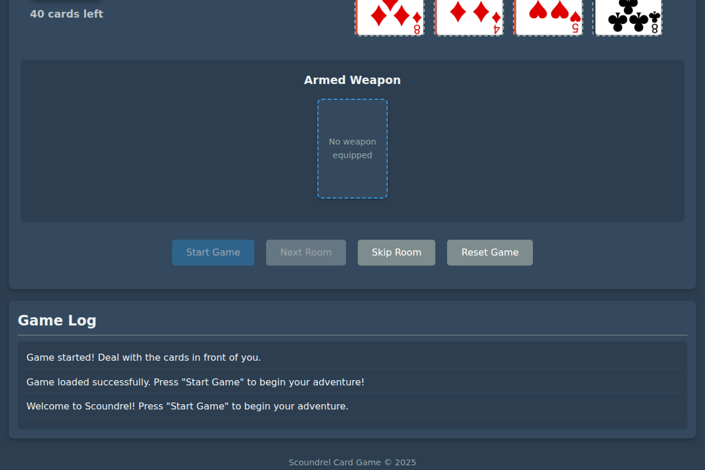
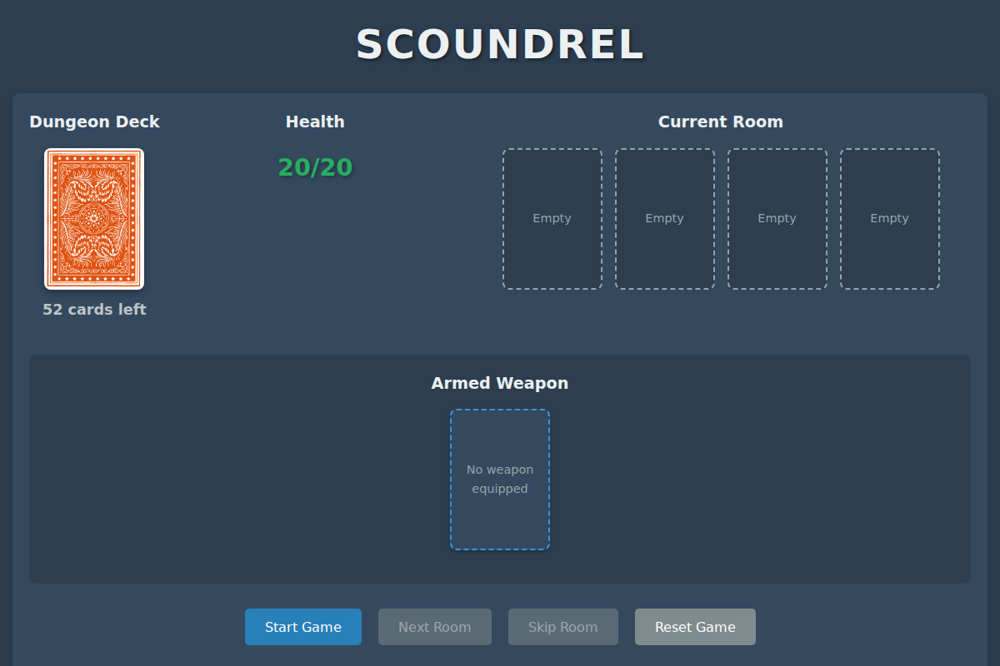
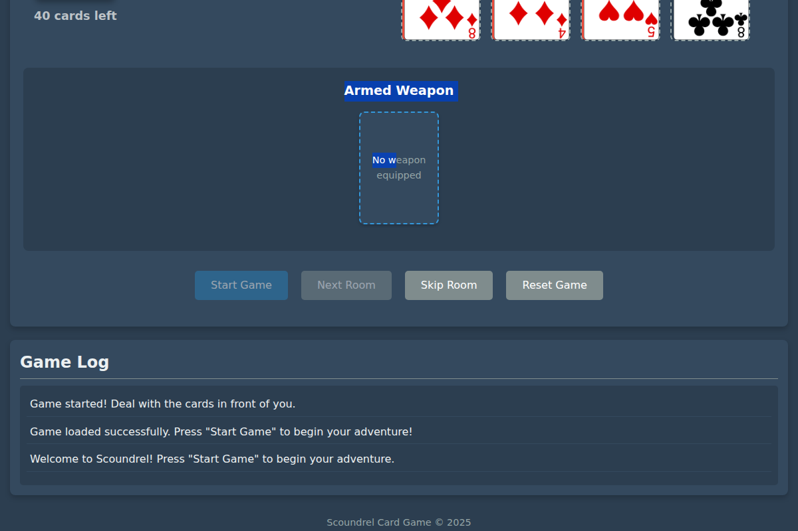
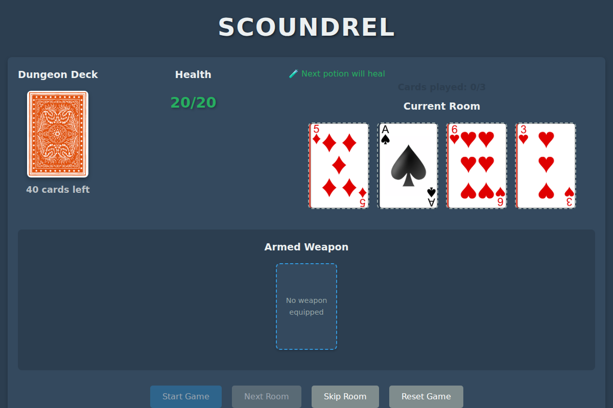

# Scoundrel Card Game

A web-based card game built with vanilla JavaScript, HTML5, and CSS3. Navigate through dangerous rooms, collect weapons and armor, and try to survive as long as possible!

<div align="center">



</div>

## 📸 Screenshots

<div align="center">

| Initial Screen | Gameplay | Multiple Rooms |
|:---:|:---:|:---:|
|  |  |  |
| Game start screen with controls | Cards dealt and equipment slots | Multiple rooms in progress |

</div>

## 🎮 Game Overview

Scoundrel is a single-player dungeon crawler card game using a trimmed deck (44 cards - no red face cards or red aces). Navigate dangerous rooms and try to clear the entire dungeon before your health reaches zero:

- **Hearts (♥)**: Health potions (first per room heals, others ignored)
- **Diamonds (♦)**: Weapons (equip to reduce monster damage)  
- **Clubs/Spades (♣♠)**: Monsters (deal damage equal to their value)

**Key Rule**: Weapons can only attack monsters "strictly weaker" than the last defeated monster.

## 🚀 Features

- **Authentic Scoundrel Rules**: Faithful implementation of the classic solo card game
- **Weapon Combat System**: Strategic equipment usage with "strictly weaker" constraints  
- **Room-Based Gameplay**: Play exactly 3 of 4 cards per room to advance
- **Health Management**: Start with 20 health, use potions wisely
- **Intuitive Interface**: Click/drag interactions with visual feedback
- **Responsive Design**: Works on desktop and mobile devices

## 🛠️ Technical Implementation

### Architecture

The game follows a modular architecture using ES6 modules:

- `main.js`: Entry point and initialization
- `game.js`: Game logic and state management
- `deck.js`: Card definitions and deck operations
- `ui.js`: DOM manipulations and UI updates
- `dragDrop.js`: Drag and drop functionality

### State Management

The game state is maintained in a central object that includes:

```javascript
{
  playerHealth: 20,
  maxHealth: 20,
  currentWeapon: null,
  currentArmor: null,
  deck: [],
  roomCards: [],
  currentRound: 0,
  gameActive: false
}
```

### Card System

Cards are represented as objects with properties including:

```javascript
{
  id: "ace_of_spades",
  suit: "spades",
  rank: "ace",
  value: 1,
  imagePath: "images/cards/ace_of_spades.png"
}
```

## 🎯 How to Play

### Quick Start Guide
1. **Start Game**: Click the "Start Game" button to begin
2. **Room Navigation**: Each room has 4 cards - you must play exactly 3 to advance
3. **Card Interactions**:
   - **Hearts (♥)**: Click to heal (first potion per room only)
   - **Diamonds (♦)**: Click to equip as weapons 
   - **Clubs/Spades (♣♠)**: Monsters - choose weapon or bare-handed combat
4. **Combat**: Weapons reduce damage but follow "strictly weaker" rule
5. **Objective**: Clear the entire dungeon without your health reaching 0

### Game Controls
- **Start Game**: Begin a new adventure
- **Next Room**: Move to next room (requires 3 cards played)
- **Reset Game**: Start over
- **Skip Room**: Place all 4 cards under deck, deal fresh 4 (can't skip twice in a row)

## 🌐 Live Demo

**Play the game online**: [https://gscalzo.github.io/scoundrel](https://gscalzo.github.io/scoundrel)

## 🖥️ Development

### Prerequisites
No build tools or dependencies required! Just a modern web browser.

### Installation
1. Clone the repository:
   ```bash
   git clone https://github.com/gscalzo/scoundrel.git
   ```
2. Start local server: `./start_game.sh` or `python3 -m http.server 8000`
3. Open `http://localhost:8000` in your browser

### Quick Deployment to GitHub Pages
1. **Fork** this repository to your GitHub account
2. **Enable GitHub Pages**: Settings → Pages → Source: "GitHub Actions"  
3. **Push to main branch** - deployment happens automatically after tests pass
4. **Access your game** at `https://yourusername.github.io/scoundrel`

### 🧪 Testing

**All tests must pass before deployment.** Run tests using:

- **Browser**: Open `tests/test.html` and click "🚀 Run All Tests"
- **Headless**: `./run_test.sh` (for CI/CD)
- **Quick check**: `cd tests && node quick-test.js`

**Test Coverage**: Unit tests (game logic, deck operations), Integration tests (module interactions), Deployment sanity checks.

**CI/CD**: Tests run automatically on pull requests. All checks must pass before merging.

### Project Structure

```
scoundrel/
├── index.html           # Main game page
├── css/
│   └── style.css        # Game styling
├── js/
│   ├── main.js          # Main entry point
│   ├── game.js          # Game logic
│   ├── deck.js          # Card & deck operations
│   ├── ui.js            # UI manipulations
│   └── dragDrop.js      # Drag & drop functionality
└── images/
    ├── cards/           # Card images (52 standard cards)
    └── ui/              # UI elements
```

## 🔮 Future Enhancements

- **Save System**: Save and load game progress
- **Multiple Decks**: Add expansions with new card types
- **Character Classes**: Different starting abilities and stats
- **Achievements**: Track player accomplishments
- **Sound Effects**: Add audio feedback for actions
- **Animations**: Enhance visual feedback

## 🤝 Contributing

1. **Fork** the repository and create a feature branch
2. **Make your changes** and add unit tests (required for new features)  
3. **Run tests**: `./run_test.sh` (must pass)
4. **Submit a Pull Request** - automated testing will run
5. **Code review** and merge after all checks pass

**Required**: Unit tests, integration tests, security checks, and test coverage must all pass.

## 📄 License

This project is licensed under the MIT License - see the [LICENSE](LICENSE) file for details.

## 🙏 Acknowledgments

- Card images from [here](https://code.google.com/archive/p/vector-playing-cards/)
- Inspiration from classic card games and roguelike mechanics

---

Developed with ❤️ and JavaScript in 2025
